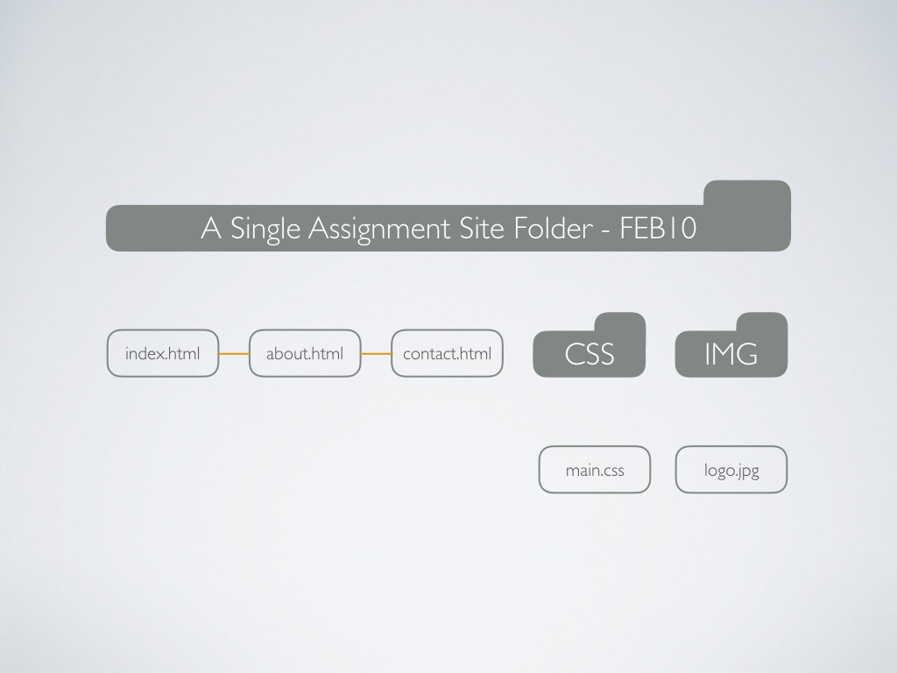

#Routes, Directories, Links and URLS

Before move on let’s take a moment to look at linking between files and folders within our site.

We will use a relatively simple site, with a home, about and contact page. We can set up our site 2 different ways:


Method 1 – Page Names in File Name

If we want to link to the homepage of this example site on our server:
```
http://sites.bxmc.poly.edu/~yournamefolder/HW/Week2/
```
OR
```
http://sites.bxmc.poly.edu/~yournamefolder/HW/Week2/index.html
```
Notice we don’t have to put in the index.html in the link. This is because a browser will always open the index.html file in any folder by default.

If we want to link to the contact of this example site on our server:
```
http://sites.bxmc.poly.edu/~yournamefolder/HW/Week2/contact.html
```
Notice we need to specify contact.html file within out Week2/ folder

---


Method 2 – Each Page as Own Directory Folder with Index.html within

If we want to link to the homepage of this example site on our server:
```
http://sites.bxmc.poly.edu/~yournamefolder/HW/Week2/
```
OR
```
http://sites.bxmc.poly.edu/~yournamefolder/HW/Week2/index.html
```
Notice the options are exactly the same as the previous example because the homepage index.html file is still within our Week2/ directory.

If we want to link to the contact of this example site on our server:

```
http://sites.bxmc.poly.edu/~yournamefolder/HW/Week2/contact/
```
OR
```
http://sites.bxmc.poly.edu/~yournamefolder/HW/Week2/contact/index.html
```
Notice we need to enter the contact folder in our URL. Since there is an index.html file within it we have to option to omit it from the url.

 

### Linking to Files Within Site Folders:

The above examples show us how our files will appear as URLs on our web server to others. But what if we are just developing a new site on our computer, and we don’t know the final server name? The good news is we don’t ever need to use those giant URLs in development unless we are linking to an external site.

Lets look at the same HW Assignment Site Folders again.

In the first example, we have:

* index.html (homepage)
* about.html
* contact.html
all within the same folder. Let’s take a look at how we would write our anchor tags to link within our navigation.


Linking Web Pages within Same Parent Directory
Because all of our html files are within the same parent directory we can link to them using the file name only:

```html
<a href="index.html">HOME</a>
<a href="about.html">ABOUT</a>
<a href="contact.html">CONTACT</a>
```

The same hrefs can be used on all three pages of the site.

In the second example, we have:

* index.html (homepage)
* ABOUT DIRECTORY/FOLDER ->with an index.html within
* CONTACT DIRECTORY/FOLDER ->with an index.html within

We now need to jump in and out of child directories from the parent directory. Let’s take a look at how we would write our anchor tags to link within our navigation.


Linking web pages that are in both parent and child directories

We now have to write our links on our homepage differently than the subpages since the homepage lives in the parent directory, and the contact and about pages live in child or subdirectories. Luckily, we are linking to the index files within our subdirectories, so specifying the file name is optional.

HOMEPAGE NAV LINKS:
```
<a href="./">HOME</a>
<a href="about/">ABOUT</a>
<a href="contact/">CONTACT</a>
```

ABOUT NAV LINKS:
```
<a href="../">HOME</a>
<a href="./">ABOUT</a>
<a href="../contact/">CONTACT</a>
```
CONTACT NAV LINKS:
```
<a href="../">HOME</a>
<a href="../about/">ABOUT</a>
<a href="./">CONTACT</a>
```
---
### Review:

Let’s talk about what these “.” and “/” all mean:

When linking to a file within the same or current directory we specify the filename we wish to link to:

From homepage to about page:
```
<a href="about.html">ABOUT</a>
```
---
When linking to a file within a subdirectory of the current file, we need to first “jump into” or open the subdirectory by specifying the subdirectory name followed by a /:

From homepage to about page:
```
<a href="about/">ABOUT</a>
```
---
When we are linking from a file within a subdirectory of the file we are linking to  we need to “jump out of” our current directory and in to the parent directory with ../

From about page to home:
```
<a href="../">HOME</a>
```
---
When we are linking to a file within a different subdirectory than the file we are linking from we need to combine the above two examples by first entering the current subdirectory’s parent using ../ and then “jumping into” the other subdirectory be specifying the subdirectory’s name followed by a /

From about page to contact:
```
<a href="../contact">CONTACT</a>
```
---
## In Class Exercise:

Based on the notes above, create a working navigation semantic markup `<nav>` `<ul>` `<li>` and `<a>` for both sites in the In_Class directory.

If you finish early, try inserting images from the `img/` folder into each page as well!
