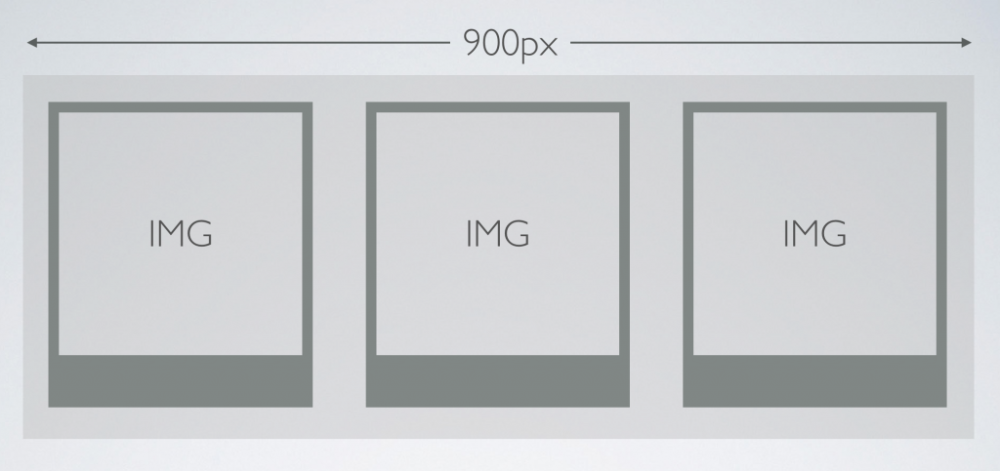
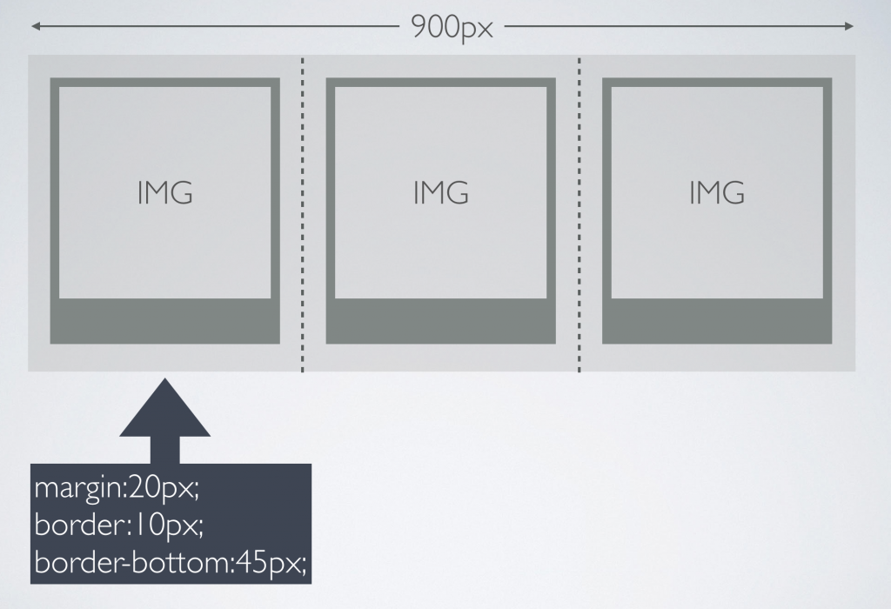

# Box Model and Simple Layouts Using CSS

Today we are going to make a single page image gallery about NYC.

## Box Model and Pixel Math

First let’s do a little math to make sure we can fit 3 images perfectly spaced within a 900px container div that is centered on the page.



[W3 Schools Box Model Explained](http://www.w3schools.com/css/css_boxmodel.asp)

We are going to use margins for transparent space between each image container, and borders to create the “polaroid” uneven border around the image.



So if we are trying to fit 3 polaroids perfectly within our 900px container, what is the width of each div?

```
900px/3 = 300px 
(remember this includes margins and borders!)
```

So if we have 300px to work with, we need to first subtract our margins from either side:
```
300px - 40px = 260px 
(remember to subtract 20px twice for the right margin and the left margin)
```

OK. We are down to 260px to work with. But what about the border? Remember, unlike margins, borders and padding both add dimension to an element’s width.
```
260px - 20px = 240px
(remember we have 10px on the left AND right so we need to subtract 20px, not 10px)
```
### In Class Exercise:
What if our container div is 1000px wide and we want to fit 4 images per row?